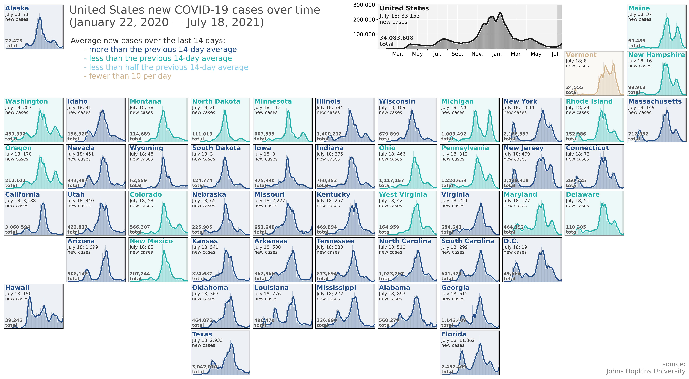
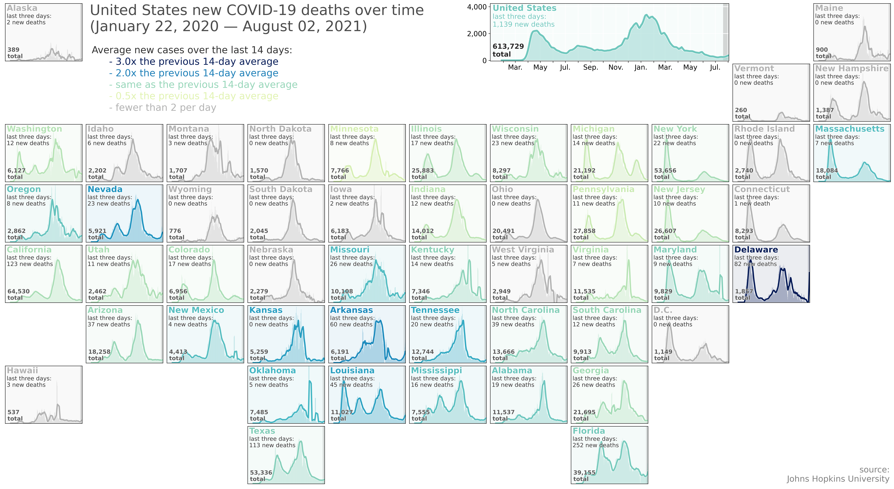
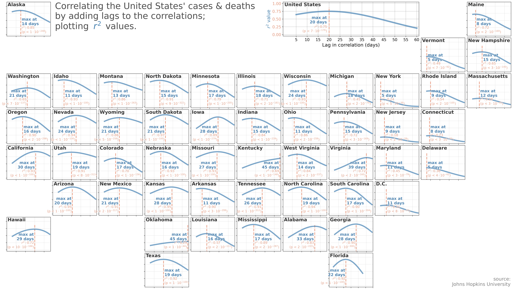
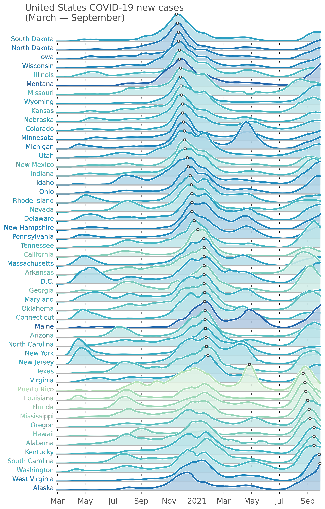
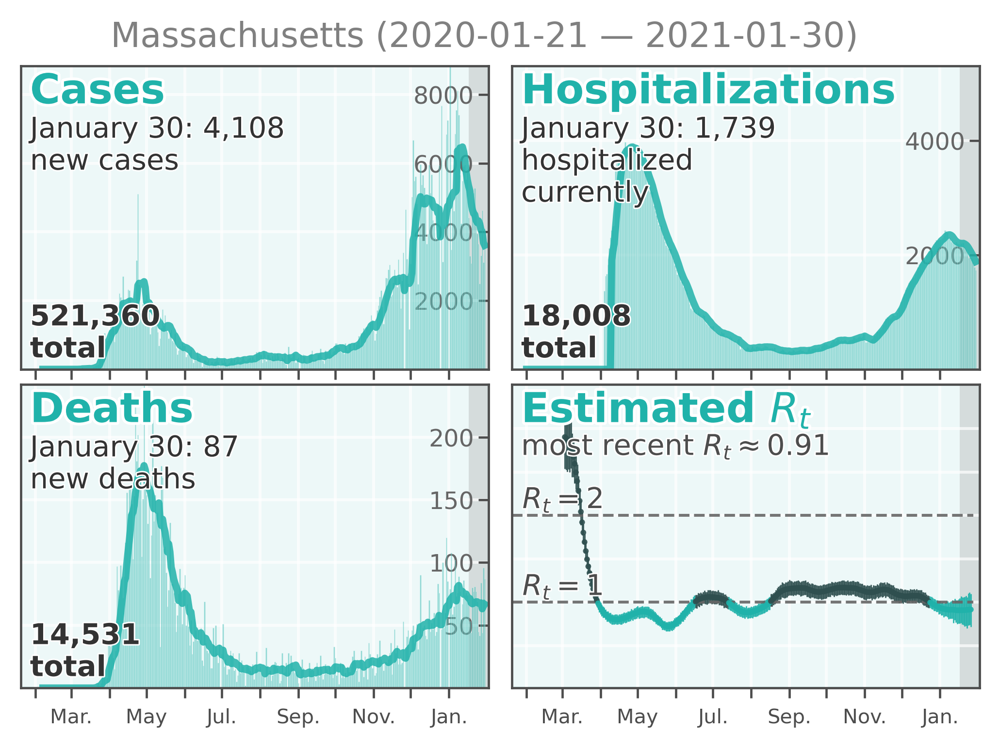

# covid-19-visualizations
Repository to collect various visualizations I've done during the pandemic. Relies heavily on [NYT](https://github.com/nytimes/covid-19-data) data, [COVID Tracking Project](https://covidtracking.com/) data, and [rt.live](rt.live).

------

------

------

------

------

------

------

