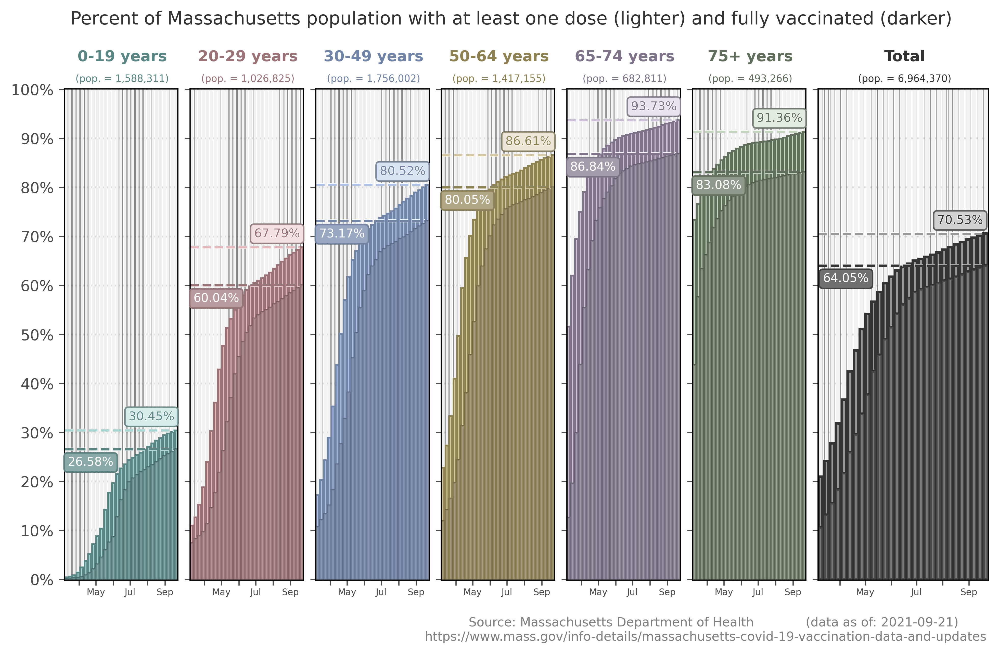
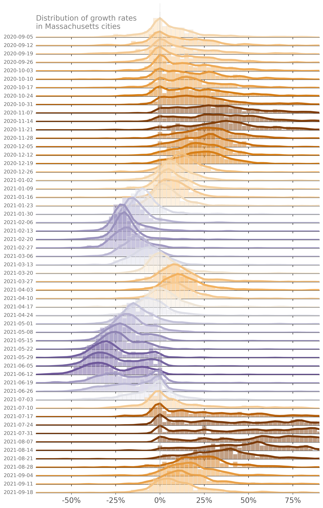
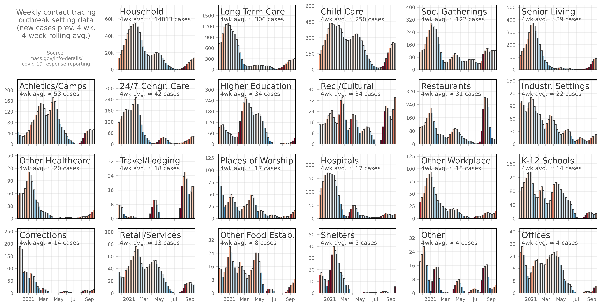
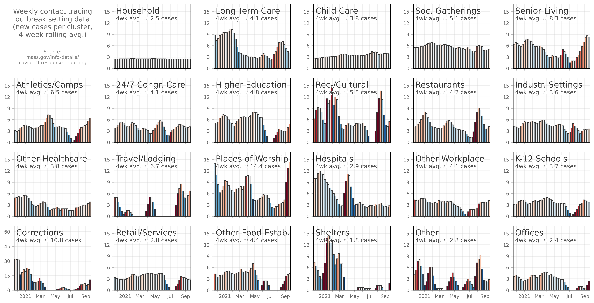

# Massachusetts-specific

data source: https://docs.google.com/spreadsheets/d/1fgJg09NSPOLjOOpBV_nQIxmXVR5xY7WOZxeBuRV9qcc/edit?usp=sharing

------

------

------

------

------

------

------

